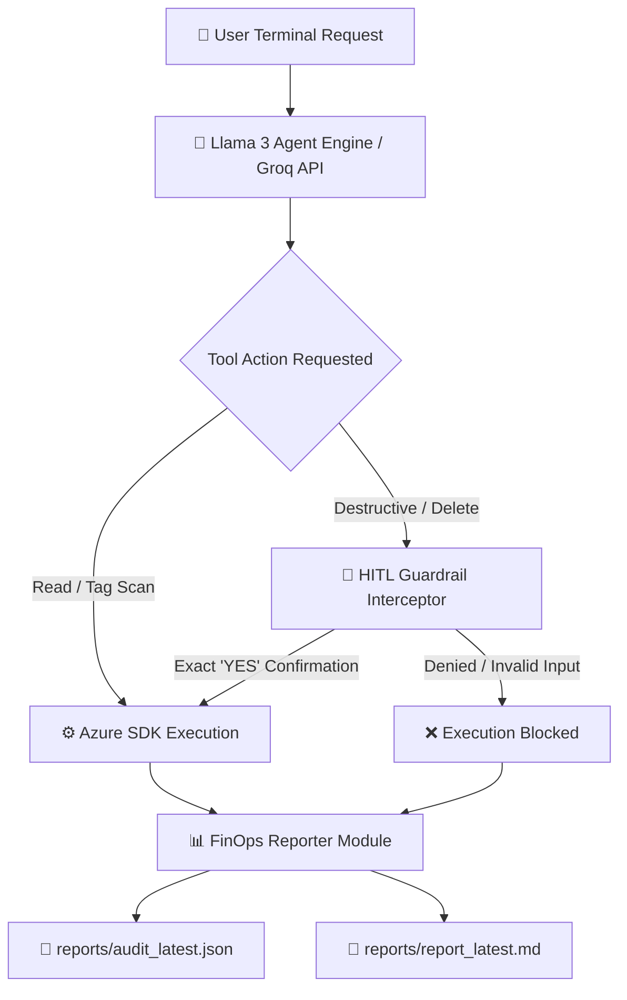

# 🛡️ FinOpsSentinel: Autonomous Cloud FinOps & Governance AI Agent


**FinOpsSentinel** is an autonomous CLI-based AI agent powered by **Llama 3 (via Groq API)** and native **Azure SDKs**. It scans cloud infrastructure for orphaned and wasteful resources, automatically applies cost-governance tags, enforces strict Human-in-the-Loop (HITL) approval guardrails for destructive actions, and exports audit-ready JSON and Markdown reports.

---

## 📑 Table of Contents
- [Architecture & Workflow](#-architecture--workflow)
- [Key Features](#-key-features)
- [Prerequisites](#-prerequisites)
- [Installation & Quickstart](#-installation--quickstart)
- [Usage Examples](#-usage-examples)
- [Generated Audit Artifacts](#-generated-audit-artifacts)
- [Development Roadmap](#-5-day-development-roadmap)
- [Multi-Cloud Extensibility](#-multi-cloud-extensibility)

---

## 🛠 Architecture & Workflow



### 🧱 Repo fileflow
```
FinOpsSentinel/
├── .github/
│   └── workflows/
│       └── docker-publish.yml    # GitHub Actions workflow for Docker Hub CI/CD
├── reports/                      # Output directory for audit reports
│   ├── finops_audit_report.json  # Comprehensive audit results
│   ├── audit_latest.json         # Latest execution scan data
│   └── report_latest.md          # Generated Markdown summary report
├── myModule/
│   ├── __init__.py               # Marks 'myModule' as a valid Python package
│   ├── ai_auditor.py             # LLM engine integration for cost analysis
│   ├── azure_scanner.py          # Azure SDK integration for resource scanning
│   ├── guardrails.py             # HITL approval checks & execution guardrails
│   ├── remediator.py             # Cloud resource cleanup & remediation engine
│   ├── reporter.py               # Report generation logic (Markdown & JSON)
│   └── tools.py                  # Shared helper utilities   
├── main.py                       # CLI entry point at root (imports from myModule)
├── Dockerfile                    # Container definition file
├── .env                          # Local environment variables (API keys, credentials)
├── .gitignore                    # Files excluded from Git tracking
├── LICENSE                       # Project license file
├── README.md                     # Project documentation
└── requirements.txt              # Python package dependencies
```

---

## ✨ Key Features
- **Autonomous Tool Selection & Chaining:** Llama 3 dynamically selects which tools to execute (scan_orphaned_disks, scan_unassigned_public_ips, tag_azure_resource, delete_azure_resource) based on natural-language instructions.
- **Human-in-the-Loop (HITL) Guardrails:** Intercepts high-risk operations (e.g., resource deletion) and requires explicit uppercase YES human confirmation before proceeding.
- **Automated Financial Governance:** Automatically calculates projected waste and tags orphan resources (FinOpsSentinelStatus: Orphaned, EstimatedMonthlyCostUSD).
- **Audit-Ready Reporting:** Generates timestamped JSON audit logs and Markdown executive summaries upon session exit.
- **Safe Execution Modes:** Runs in DRY-RUN simulation mode by default, or live remediation mode via the --apply flag.

---
## 🎯 Prerequisities
Before installing FinOpsSentinel, ensure you have:
<ol>
  <li> Python 3.10+ installed on your system.</li>
  <li> Azure CLI (az) installed and authenticated (az login).
  <ol>
      <li> If you are a student, you can get a free Azure student account by registering at https://azure.microsoft.com/en-us/free/students or through GitHub Developer for Students using your student email ID and college ID card, etc. (provided by your college) <br>
      https://github.com/settings/education/benefits</li>
  </ol>
  </li>
  <li> Groq API Key with access to Llama 3 models.</li>
</ol>

---

## 👨‍💻 Installation & Quickstart
### Step 1: Clone the Repository

```
git clone https://github.com/07deepika/FinOpsSentinel.git
cd FinOpsSentinel
```

### Step 2: Environment Configuration
Create a .env file in the root directory by copying the example template:

```
cp .env.example .env
```
Open .env and add your API keys and Azure details:
```
GROQ_API_KEY=your_groq_api_key_here
AZURE_SUBSCRIPTION_ID=your_azure_subscription_id_here
```
### Step 3: Authenticate with Azure
Ensure your host machine is authenticated with Azure so the container can access your credentials:
```
az login
```
### Step 4: Run FinOpsSentinel
You can run the application using the Docker CLI.
- Dry-Run Mode (Safe Scan):
```
docker run -it --rm \
  --env-file .env \
  -v ~/.azure:/root/.azure \
  -v $(pwd)/reports:/app/reports \
  07deepika/finops-sentinel:latest
```
- Live Mode (Scan with HITL Remediation):
```
docker run -it --rm \
  --env-file .env \
  -v ~/.azure:/root/.azure \
  -v $(pwd)/reports:/app/reports \
  07deepika/finops-sentinel:latest --apply
```

---

## 💪🏻 Usage Examples
---

## 🧩 Generated Audit Artifacts
Upon session termination, FinOpsSentinel exports structured audit reports to the ```reports/``` folder:
- ```reports/audit_latest.json```: Complete execution trail with arguments, execution timestamps, and status flags.
- ```reports/report_latest.md```: Clean, human-readable summary table for leadership and finance teams.
---

## 🗺 Development Roadmap
The FinOpsSentinel development plan is structured into phased milestones, moving from initial containerized MVP to an enterprise-ready, multi-cloud governance platform.
### Phase 1: Core Engine & Single-Cloud Baseline (Completed ✅)
- [x] Azure Resource Scanner: Detect unattached Public IPs, unattached Managed Disks, and stopped/idle Virtual Machines.
- [x] LLM Cost Analysis: Generate summaries and estimated savings using Groq / Llama 3.
- [x] HITL Safety Guardrails: Interactive YES prompt confirmation before applying any destructive CLI modifications.
- [x] Containerization & CI/CD: Automated Docker builds pushed to Docker Hub via GitHub Actions.
### Phase 2: State Verification & Extended Asset Coverage (In Progress 🏗️ _TO_DO_)
- [ ] Post-Remediation Re-Scan (State Flush): Automatically trigger an immediate infrastructure re-audit after remediation to prevent false positives in final reports (finops_audit_report.json and report_latest.md).
- [ ] Expanded Orphaned Asset Detection:
      - 
---

## 🎪 Multi-Cloud Extensibility
While native Azure SDK support is active, FinOpsSentinel is built with extensible tool schemas:
- Azure: Managed Disks & Public IP scanning/remediation (Active SDK).
- AWS: Elastic Block Store (scan_aws_unattached_ebs) schema endpoints.
- GCP: Compute Engine Persistent Disk (scan_gcp_idle_disks) schema endpoints.

---

## 📜 License
Distributed under the MIT License. See ```LICENSE``` for more details.
