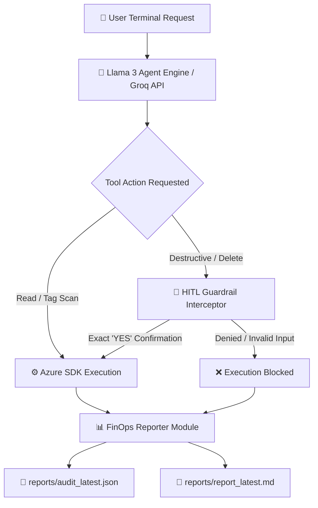

# 🛡️ FinOpsSentinel: Autonomous Cloud FinOps & Governance AI Agent

**FinOpsSentinel** is an autonomous CLI-based AI agent powered by **Llama 3 (via Groq API)** and native **Azure SDKs**. It scans cloud infrastructure for orphaned and wasteful resources, automatically applies cost-governance tags, enforces strict Human-in-the-Loop (HITL) approval guardrails for destructive actions, and exports audit-ready JSON and Markdown reports.

---

## 📑 Table of Contents
- [Architecture & Workflow](#-architecture--workflow)
- [Key Features](#-key-features)
- [Prerequisites](#-prerequisites)
- [Installation & Quickstart](#-installation--quickstart)
- [Usage Examples](#-usage-examples)
- [Generated Audit Artifacts](#-generated-audit-artifacts)
- [5-Day Development Roadmap](#-5-day-development-roadmap)
- [Multi-Cloud Extensibility](#-multi-cloud-extensibility)

---

## 🧱 Architecture & Workflow

---

## ✨ Key Features
### Autonomous Tool Selection & Chaining: 
Llama 3 dynamically decides which tools to execute (scan_orphaned_disks, scan_unassigned_public_ips, tag_azure_resource, delete_azure_resource) based on natural language instructions.
### Human-in-the-Loop (HITL) Guardrails: 
Intercepts high-risk operations (e.g., resource deletion) and requires explicit uppercase YES human confirmation before proceeding.
### Automated Financial Governance: 
Automatically calculates projected waste and tags orphan resources (FinOpsSentinelStatus: Orphaned, EstimatedMonthlyCostUSD).
### Audit-Ready Reporting: 
Generates timestamped JSON audit logs and Markdown executive summaries upon session exit.
### Safe Execution Modes: 
Runs in DRY-RUN simulation mode by default, or live remediation mode via the --apply flag.

---
## 🧱 Architecture & Workflow
Before installing FinOpsSentinel, ensure you have:
<ol>
  <li> Python 3.10+ installed on your system.</li>
  <li> Azure CLI (az) installed and authenticated (az login).
  <ol>
      <li> If you are a student, you can get free Azure student account by registering through your student email id(provided by college)  
      https://github.com/settings/education/benefits</li>
  </ol>
  </li>
  <li> Groq API Key with access to Llama 3 models.</li>
</ol>
